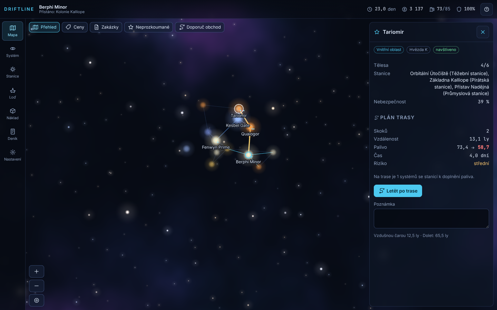
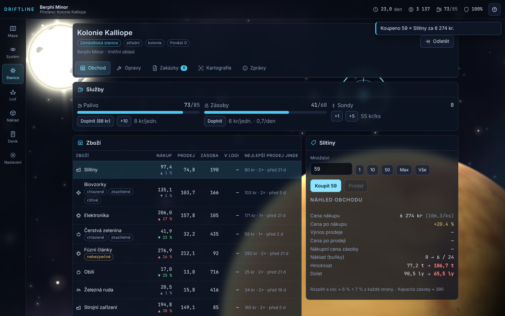
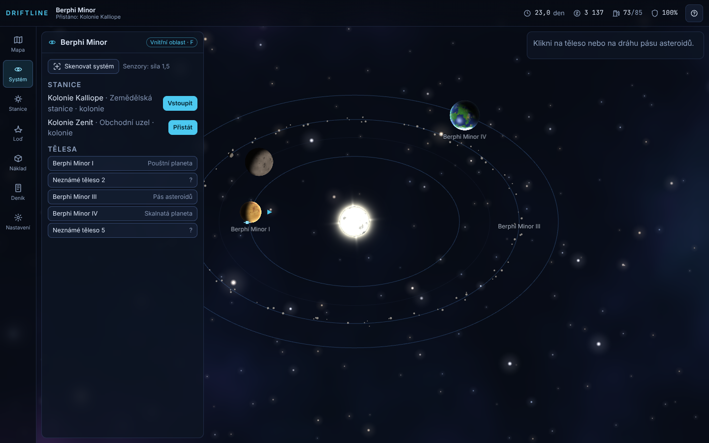
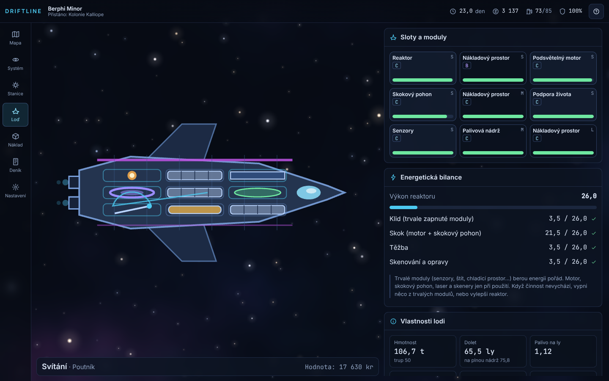
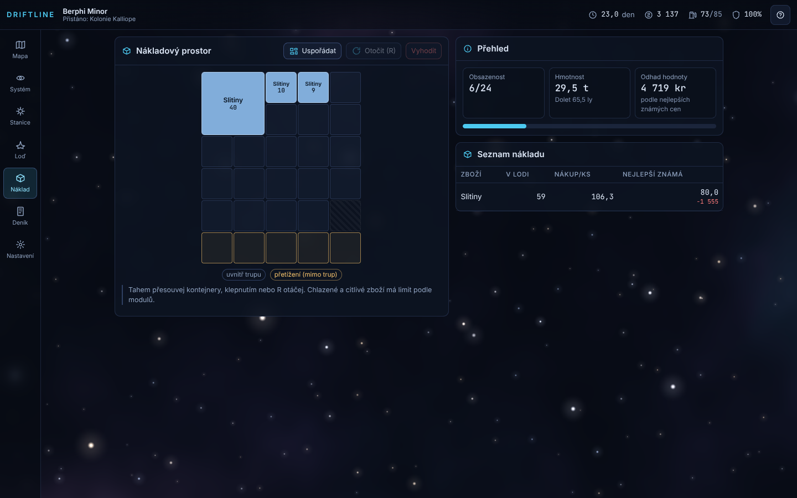
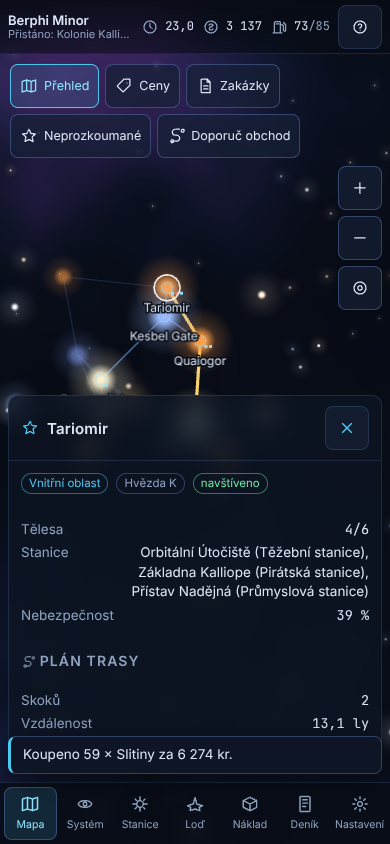
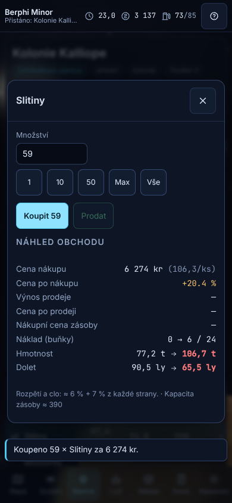

# Driftline

Klidná obchodně-průzkumná hra o malé lodi v procedurálně generované galaxii. Obchoduješ, plníš zakázky, zkoumáš neznámé systémy, těžíš a vylepšuješ loď. Běží **v prohlížeči** (PC, tablet i mobil), jde nainstalovat jako aplikace a hrát **úplně offline**. Všechno, co vidíš a slyšíš, vzniká v kódu: planety jsou shadery, lodě vektorové siluety, zvuk se syntetizuje za běhu.

> Verze **1 ze 3**: loď, náklad, obchod, průzkum. Verze 2 přidá boj a posádku, verze 3 základnu, frakce, hrozbu a konce. Architektura na to počítá (viz [docs/DECISIONS.md](docs/DECISIONS.md)).



| Stanice a obchod | Systém | Loď a energie |
|---|---|---|
|  |  |  |

| Náklad | Mobil: mapa | Mobil: obchod |
|---|---|---|
|  |  |  |

## Jak hrát

1. **Obchod:** ve stanici otevři *Obchod*, vyber zboží, které je u vás levné, a kup ho. Sloupec „Nejlepší prodej jinde“ ukazuje nejvyšší známou cenu v okolí (a jak je stará).
2. **Skok:** na *Mapě* klikni na sousední systém a skoč. Plánovač trasy ukáže palivo, čas a riziko. Víc skoků najednou zvládne autopilot (mezerník ho pozastaví).
3. **Prodej:** v cíli přistaň (*Systém → Přistát*) a zboží prodej. Velké objemy posouvají cenu, rozdíl cen se po čase srovná, takže opakovat jednu trasu donekonečna se nevyplatí.
4. **Zakázky** (nástěnka ve stanici): přeprava, kurýr, cestující, průzkum, dodávka surovin, záchrana. Zálohu dostaneš hned, nesplnění stojí pokutu. Zakázky do stejného cíle dostanou bonus.
5. **Průzkum a těžba:** skenuj systém, povrch těles a použij sondy. Ložiska těžíš s odstupňovaným rizikem (vyšší intenzita = víc suroviny, víc paliva, víc rizika) a výnos na jednom místě klesá. Průzkumná data prodávej v kartografii (v neprobádaných oblastech platí nejvíc).
6. **Loď:** moduly spotřebovávají energii z reaktoru, některé zlepšují jen sousední sloty, všechno se opotřebovává. V loděnici vidíš před koupí změnu vlastností zeleně a červeně.
7. **Smrt:** s pojištěním se probudíš v poslední stanici (ztratíš náklad a nepojištěné moduly). Při nové hře můžeš zapnout **trvalou smrt**.

### Ovládání

| Akce | Myš | Klávesnice | Dotyk |
|---|---|---|---|
| Mapa: posun / přiblížení | tažení / kolečko | `+` `−` | tažení / dva prsty |
| Výběr systému, tělesa | klik | | klepnutí |
| Náklad: přesun, otočení | tažení, klik na vybraný | `R` | tažení, další klepnutí |
| Mapa, Systém, Stanice | | `M`, `Y`, `S` | spodní navigace |
| Loď, Náklad, Deník, Nastavení | | `L`, `C`, `J`, `O` | spodní navigace |
| Zpět / zavřít okno | | `Esc` | |
| Pauza autopilota | | `Mezerník` | tlačítko |
| Nápověda | | `?` | tlačítko ? |

Všechna ovládací tlačítka mají na dotykových zařízeních alespoň 44 px.

## Instalace jako aplikace

Hra je PWA. V Chromiu a Edgi klikni na ikonu instalace v adresním řádku, ve Firefoxu pro Android *Přidat na plochu*, v Safari *Sdílet → Přidat na plochu*. Po první návštěvě se vše uloží do zařízení a hra běží bez připojení. Uložené hry zůstávají v zařízení (IndexedDB), zálohovat je jde exportem do souboru v *Nastavení*.

## Spuštění lokálně

```bash
npm i
npm run dev          # vývojový server (http://localhost:5173)
npm run build        # produkční build do dist/ (včetně PWA)
npm run preview      # náhled buildu na http://localhost:4173
```

Další užitečné příkazy:

```bash
npm test             # Vitest, jádro simulace
npm run test:cov     # + pokrytí
npm run test:e2e     # Playwright (desktop 1440×900, mobil 390×844)
npm run balance      # balanční simulátor, zapíše docs/balance.md
npm run lint         # ESLint + Prettier
```

V sandboxu s předinstalovaným Chromiem se použije `PLAYWRIGHT_BROWSERS_PATH`/`/opt/pw-browsers`; jinde jednou spusť `npx playwright install chromium`.

## Nasazení na GitHub Pages

Workflow `.github/workflows/deploy.yml` je připravený: po každém pushi do `main` spustí testy jádra, sestaví hru s `BASE_PATH=/<název-repozitáře>/` a nahraje ji na Pages. **Zapnutí Pages je na tobě**, jednorázově:

1. V repozitáři otevři *Settings → Pages*.
2. V části *Build and deployment* nastav *Source* na **GitHub Actions**.
3. Pushni do `main` (nebo spusť workflow *Deploy to GitHub Pages* ručně). Adresa bude `https://<uživatel>.github.io/<repozitář>/`.

Pro vlastní server stačí obsah `dist/` vystavit jako statické soubory (`BASE_PATH` nastav podle podadresáře, výchozí je relativní `./`). Backend hra nepotřebuje.

## Architektura ve zkratce

- `src/core`: **čistá, deterministická simulace** (TypeScript, bez DOM a Pixi, vlastní PRNG podle semínka). Stav je JSON s verzí a migracemi.
- `src/content`: data (zboží, trupy, moduly, typy stanic, události, řetězce zakázek).
- `src/render`: PixiJS v8 se shadery (planety, hvězdy, mlhoviny), generátor lodí.
- `src/ui`: Preact + Signals, česky přes slovník `src/i18n/cs.ts`.
- `src/sim`: boti a balanční simulátor (`npm run balance`).

Podrobněji: [docs/DESIGN.md](docs/DESIGN.md) (systémy a vzorce), [docs/DECISIONS.md](docs/DECISIONS.md) (rozhodnutí), [docs/balance.md](docs/balance.md) (vyváženost), [docs/REVIEW-v1.md](docs/REVIEW-v1.md) (revize), [CLAUDE.md](CLAUDE.md) (jak přidat modul, zboží, událost…).

## Licence

Kód je pod [MIT](LICENSE). Hra nepoužívá žádné stažené assety, písma jsou z balíčků `@fontsource` (OFL), viz [ASSETS-LICENSES.md](ASSETS-LICENSES.md).
